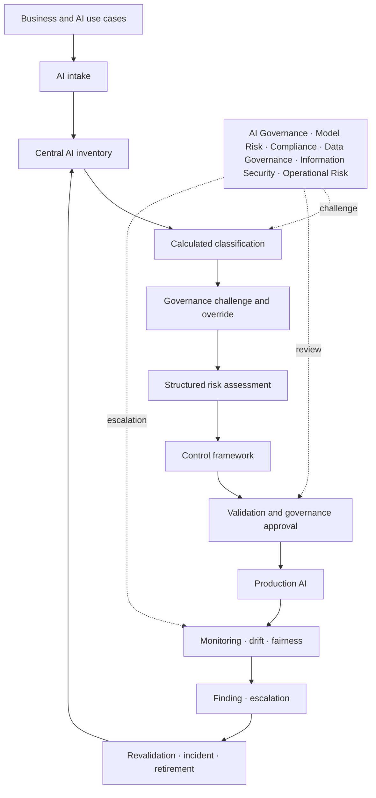

# Enterprise AI Governance & Risk Framework

> An operational reference implementation of an enterprise AI Governance and Risk Management operating model for regulated financial services.

Enterprise AI Governance & Risk Framework demonstrates how a regulated financial institution can inventory, classify, assess, approve, monitor, revalidate and retire AI systems through a controlled enterprise lifecycle. It translates AI risk and regulatory expectations into operating practice: named ownership, proportionate classification, assessment, controls, lifecycle gates, independent validation, human oversight, monitoring and auditable evidence.

The framework demonstrates operational governance decisions rather than only policy documentation. Its connected session workspace carries one AI system from intake through classification, governed expert challenge, assessment, control evidence, validation, approval, monitoring, findings and revalidation.

**This is a reference implementation using synthetic data for demonstration purposes and not a production risk-management system.**

## 1. Executive Summary

Financial institutions need to know where AI is used, who is accountable, which risks matter, what evidence is sufficient and who may accept residual risk. This repository answers those questions with an executable control model rather than a policy-only catalogue. Nine synthetic banking scenarios demonstrate proportionality: an internal coding assistant receives lighter treatment than loan decision support, fraud detection or candidate screening.

The flagship `AI-001` Loan Application Decision Support use case is classified by reusable YAML rules—not by a hard-coded label. Customer impact, consequential decisions, sensitive data, financial materiality, explainability, bias exposure and operational criticality drive enhanced controls and executive approval.

## 2. Business Problem

AI can enter a bank through model development, software procurement, embedded vendor features and employee tools. Fragmented registers and review processes create blind spots: inconsistent ownership, duplicated assessments, expired approvals and monitoring signals that do not reach decision-makers. A central workflow is needed to route each use to the right specialists and retain evidence of the decision.

## 3. Why AI Governance Needs an Operating Model

Policy states intent; an operating model defines decisions, roles, gates, evidence and consequences. Here, requirements flow through a traceable chain:

`External expectation → Policy → Process → Control → Evidence → Assurance`

The first line owns design and operation. The second line sets standards, challenges and oversees risk. Internal Audit provides third-line assurance. Committees approve material residual risk but do not displace named owners.

## 4. Business Insights

- One inventory population allows management, control functions and audit to work from the same scope.
- Transparent classification protects proportionality and makes overrides visible.
- Gates turn policy into enforceable decisions: missing validation or oversight blocks progression.
- Monitoring has value only when thresholds produce owned findings, escalation and revalidation.
- Fairness metrics are review signals; lawful and ethical fairness requires contextual judgement.
- Provider assurances do not remove institutional accountability for vendor AI.

## 5. Business Case

The framework reduces unmanaged AI exposure, avoids duplicative review and directs scarce validation capacity toward consequential uses. It creates a defensible evidence path for management and assurance while allowing low-risk productivity tools to progress with proportionate requirements. Benefits should be measured through inventory coverage, gate cycle time, overdue actions, recurring findings, incident response and control effectiveness—not through the number of forms completed.

## 6. Enterprise Solution Architecture



YAML holds classification rules, assessment questions, controls, thresholds, approval requirements and mappings. Python contains deterministic domain logic and a lightweight in-memory `GovernanceWorkspace`. Streamlit session state connects the demonstration without a database; the interface remains replaceable and is not itself the governance system. See [architecture](docs/architecture.md).

## 7. AI Governance Target Operating Model

The Business Owner is accountable for purpose, customer outcome and residual risk; Product and Technical Owners implement and operate controls; the Data Owner is accountable for data fitness. AI Governance owns framework consistency. Model Risk validates material models. Compliance, Legal, Information Security, Data Governance and Operational Risk provide domain challenge. The AI Governance or Executive Risk Committee approves high and critical uses. Internal Audit independently assesses design and effectiveness. The detailed [RACI](governance/target_operating_model.md) prevents review activity from obscuring ownership.

## 8. AI Risk Classification

The engine evaluates impact, autonomy, data, regulatory relevance, complexity, vendor dependency, explainability, bias, criticality, cyber implications and human oversight. It returns an ordinal score, `LOW / MODERATE / HIGH / CRITICAL` tier, plain-English rationale, mandatory controls, reviewers, approval level, validation scope, monitoring and revalidation frequency.

Scores route work; they do not estimate loss probability and must not create fake mathematical precision. Boundaries and factor weights require institution-specific calibration, challenge and override governance. Rules are visible in [`classification_rules.yaml`](controls/classification_rules.yaml).

The calculated tier is retained as governance evidence. An authorised user may propose an effective tier with rationale. Proposed or rejected overrides do not change treatment; an approved override changes downstream controls and decision authority while preserving the original calculation.

## 9. AI Risk Assessment

Assessment covers strategic, customer/conduct, model, data, privacy, security, operational, legal/regulatory, third-party, explainability, bias/fairness, human oversight, reputational and GenAI risk. Twenty-one controlled questions capture evidence expectations and lifecycle implications. Material adverse answers create owned findings, remediation and approval conditions. The questionnaire is a structured decision aid, not a substitute for expert judgement.

## 10. AI Lifecycle

`IDEA → INTAKE → CLASSIFIED → ASSESSMENT → VALIDATION → APPROVAL → DEVELOPMENT → PRE-PRODUCTION → PRODUCTION → MONITORING → REVALIDATION → RETIRED`

Transitions follow a controlled sequence. High or critical AI cannot reach approval without independent validation. A mandatory but missing human-oversight control blocks the gate. Production requires governance approval. Suspension and controlled retirement remain available. Material change, degradation, drift, incident, regulatory change or provider-version change triggers revalidation.

## 11. Control Framework

The control library contains 22 preventive, detective and corrective controls. Every entry defines its objective, applicability, accountable role, evidence, test method, frequency, risk and illustrative regulatory mapping. Classification derives a tier-specific subset, linking risk to action without treating every AI use as high risk.

Each system records control implementation status, owner, evidence reference, reviewer, date and comments. Missing or failed mandatory evidence can block approval.

## 12. Model Monitoring & Revalidation

Synthetic time-series data covers performance, data drift, output drift, errors, exceptions, overrides, human review, fairness and incidents. Configurable thresholds produce:

- `GREEN`: continue routine monitoring;
- `AMBER`: alert, investigate and increase review;
- `RED`: create a finding, escalate, trigger revalidation and consider suspension.

The PSI drift example prioritises governance interpretation over ML sophistication. Monitoring is illustrative; production thresholds require baselines, validation, data-quality controls and system-specific calibration.

## 13. Human Oversight

The framework selects human-in-the-loop, human-on-the-loop or human-in-command based on impact, autonomy and customer exposure. High-impact banking decisions require competent review before action, an effective override, stop authority and evidence of reviewer, time, decision and rationale. Workload and automation bias must be tested, not assumed away.

## 14. Bias & Fairness

Synthetic group outcomes produce selection rates and a simple ratio-based review trigger. A breach starts investigation of data, policy, model behaviour and relevant context. It does **not** establish unlawful discrimination or ethical fairness. Assessment requires appropriate legal, compliance, statistical and business judgement and may require additional metrics.

## 15. Regulatory Mapping

The illustrative mapping shows how selected expectations from the EU AI Act, NIST AI RMF and ISO/IEC 42001 can be translated into policy, process, control and evidence. **The mapping is illustrative and must be adapted to applicable jurisdiction, regulatory interpretation and institutional policy.** It is not legal advice or a claim of compliance.

### Swiss Banking Governance Context

The [Swiss banking context](governance/swiss_banking_context.md) explains how AI governance fits enterprise risk, model governance, operational risk, information security, data governance, third-party risk, Compliance, Legal, internal controls, senior-management accountability and Internal Audit. It distinguishes confirmed external requirements, illustrative mapping and institution-specific implementation; it does not claim Swiss or FINMA compliance.

## 16. Repository Structure

```text
app.py                     Streamlit governance journey
inventory/                 Validated central inventory and service
assessments/               Classification and domain assessment logic
governance_workspace.py    Connected in-memory governance state
findings.py                Shared assessment and monitoring finding model
controls/                  Rules, taxonomy, control library and mappings
lifecycle/                 Approval gates and revalidation triggers
monitoring/                Performance, drift and fairness interpretation
oversight/                 Human-oversight design
audit/                     Hash-chained synthetic audit events
governance/                Policy, standards and target operating model
templates/                 Ten reusable governance records
data/                      Synthetic banking and monitoring datasets
docs/                      Architecture, summary and five-minute demo
tests/                     Positive and negative behavioural tests
.github/workflows/         Repeatable CI validation
```

## 17. Implementation

Requires Python 3.11+.

```bash
python -m venv .venv
source .venv/bin/activate        # Windows: .venv\Scripts\activate
pip install -r requirements.txt
streamlit run app.py
```

The code favours small typed functions, explicit controlled values and configuration over hidden rules. It deliberately avoids cloud infrastructure and heavyweight workflow dependencies so reviewers can inspect governance decisions directly.

## 18. Validation & Controls

```bash
pytest
python -c "import yaml, pathlib; [yaml.safe_load(p.read_text()) for p in pathlib.Path('.').rglob('*.yaml')]"
```

Tests cover valid and invalid inventory records, unique IDs, scoring and tier boundaries, mandatory control derivation, lifecycle sequencing, approval blocking, overdue and event-driven revalidation, monitoring thresholds, drift, fairness triggers and audit-chain tamper detection. GitHub Actions installs dependencies, runs the suite and performs import/YAML smoke checks.

## 19. Demonstration

Run the app and follow the [five-minute Loan Decision Support walkthrough](docs/demo_walkthrough.md): inventory → calculated classification → optional override → structured assessment → findings → controls → oversight → blocked/pass approval → validation → RED breach → revalidation → audit evidence. No source-file editing is required.

## 20. Limitations

- All organisations, people, providers, systems and records are synthetic.
- Rules, scores, thresholds and regulatory mappings are illustrative.
- This is not legal advice, a compliance determination or a production banking control environment.
- Actual governance must reflect applicable law, regulatory interpretation, policy, risk appetite and system context.
- Model-risk and monitoring thresholds require institutional calibration and independent validation.
- Fairness cannot be reduced to a single metric.
- Production approval decisions require an institution-specific authority matrix.
- Swiss regulatory application requires institution-specific interpretation by competent functions.
- File-based storage lacks production identity, access control, workflow, immutable retention, integration, resilience and segregation of duties.

## 21. Future Evolution

Priorities are durable workflow and evidence storage; SSO and role-based access; policy-as-code versioning and signed decisions; integration with procurement, model, data and incident inventories; portfolio reconciliation; richer fairness and GenAI evaluation; control testing and assurance workflows; notifications; and calibrated management reporting. These should follow institutional architecture and risk appetite rather than obscure the core operating model.

---

Synthetic demonstration only. No customer data, credentials, proprietary bank information or production decisions are included.
