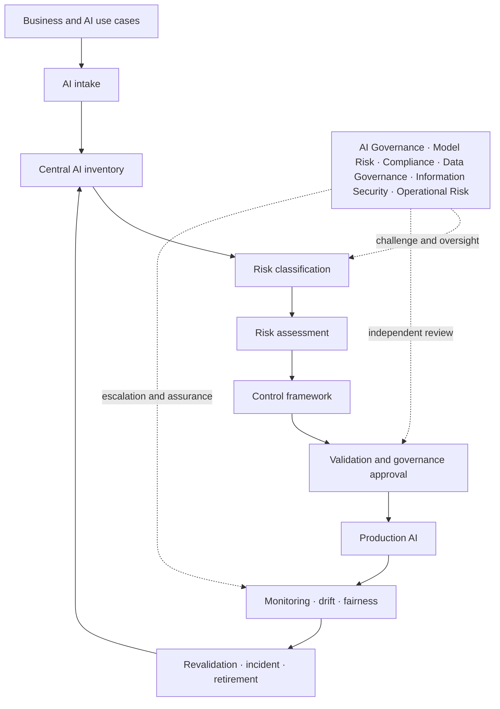

# Architecture

The repository separates policy and configuration from deterministic domain logic and the demonstration interface. YAML expresses rules, controls, thresholds and mappings. Python validates inventory data and executes classification, assessment, lifecycle, monitoring and evidence logic. CSV files contain synthetic scenarios. Streamlit presents the operating model without owning governance decisions.

The reference implementation uses local files to remain inspectable. A production architecture would add identity and access management, workflow, durable versioned storage, immutable evidence, integrations, segregation of duties and operational resilience.
